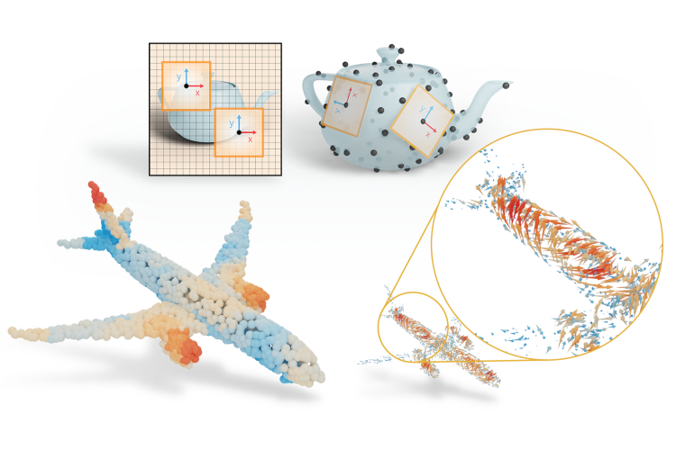

# DeltaConv
[[Paper]](https://rubenwiersma.nl/assets/pdf/DeltaConv.pdf) [[Project page]](https://rubenwiersma.nl/deltaconv)

Code for the SIGGRAPH 2022 paper "[DeltaConv: Anisotropic Operators for Geometric Deep Learning on Point Clouds](https://arxiv.org/abs/2111.08799)" by Ruben Wiersma, Ahmad Nasikun, Elmar Eisemann, and Klaus Hildebrandt.

Anisotropic convolution is a central building block of CNNs but challenging to transfer to surfaces. DeltaConv learns combinations and compositions of operators from vector calculus, which are a natural fit for curved surfaces. The result is a simple and robust anisotropic convolution operator for point clouds with state-of-the-art results.



*Top: unlike images, surfaces have no global coordinate system. Bottom: DeltaConv learns both scalar and vector features using geometric operators.* 

## Contents
- [Installation](#installation)
- [Replicating the experiments](#replicating-the-experiments)
- [Tests](#tests)
- [Citation](#citations)

## Installation
Clone this repository with its submodules:
```bash
git clone --recurse-submodules https://github.com/rubenwiersma/deltaconv.git
```

Forgot to clone submodules recursively? Fix it with
`git submodule update --init --recursive`

You can setup the environment by running the `install.sh` bash script:
```bash
bash install.sh
```

### Manual installation
We provide a conda environment to be used with DeltaConv. It contains an installation of PyTorch and PyTorch Geometric, and some libraries to help keep track of training. Install the environment with:
```bash
conda env create -n deltaconv -f environment.yml
```

If you wish to install DeltaConv from this folder, you can add the `-e` flag.
This will allow you to directly test changes in the codebase without needing to reinstall. 
```bash
pip install -e ./
```

## Replicating the experiments
See the README.md in `experiments/replication_scripts` for instructions on replicating the experiments.

In short, you can run bash scripts to replicate our experiments. For example, training and evaluating ShapeNet:
```bash
cd [root_folder]
conda activate deltaconv
bash replication_scripts/shapenet.sh
```
Pre-trained weights are available in `experiments/pretrained_weights` and scripts to evaluate them in `experiments/replication_scripts/pretrained`.

You can also directly run the python files in `experiments`:
```bash
python experiments/train_shapenet.py
```
Use the `-h` or `--help` flag to find out which arguments can be passed to the training script:
```bash
python experiments/train_shapenet.py -h
```

You can keep track of the training process with tensorboard:
```bash
tensorboard logdir=experiments/runs/shapenet_all
```

### Anisotropic Diffusion
The code that was used to generate Figure 2 from the paper and Figure 2 and 3 from the supplement is a notebook in the folder `experiments/anisotropic_diffusion`.

## Data
The training scripts assume that you have a `data` folder in `experiments`. ModelNet40 and ShapeNet download the datasets from a public repository. Instructions to download the data for human body shape segmentation, SHREC, and ScanObjectNN are given in the training scripts.

## Tests
In the paper, we make statements about a number of properties of DeltaConv that are either a result of prior work or due to the implementation. We created a test suite to ensure that these properties hold for the implementation, along with unit tests for each module. For example:
- Section 3.6, 3.7: Vector MLPs are equivariant to norm-preserving transformations, or coordinate-independent (rotations, reflections)
    - `test/nn/test_mlp.py`
    - `test/nn/test_nonlin.py`
- Section 3.7: DeltaConv is coordinate-independent, a forward pass on a shape with one choice of bases leads to the same output and weight updates when run with different bases
    - `test/nn/test_deltaconv.py`
- Introduction, section 3.2: The operators are robust to noise and outliers.
    - `test/geometry/test_grad_div.py`
- Supplement, section 1: Vectors can be mapped between points with equation (15).
    - `test/geometry/test_grad_div.py`

## Citations
Please cite our paper if this code contributes to an academic publication:

```bib
@Article{Wiersma2022DeltaConv,
  author    = {Ruben Wiersma, Ahmad Nasikun, Elmar Eisemann, Klaus Hildebrandt},
  journal   = {Transactions on Graphics},
  title     = {DeltaConv: Anisotropic Operators for Geometric Deep Learning on Point Clouds},
  year      = {2022},
  month     = jul,
  number    = {4},
  volume    = {41},
  doi       = {10.1145/3528223.3530166},
  publisher = {ACM},
}
```